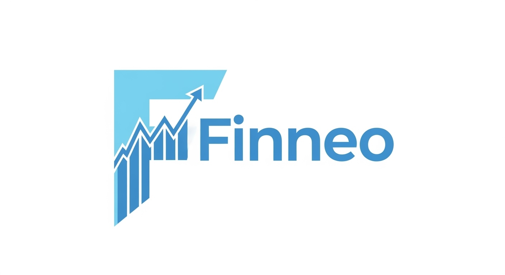

# 📊 Finneo - Dashboard de Finanças Pessoais

## 📄 Sobre o Projeto

O Finneo é um projeto de front-end desenvolvido como parte da disciplina de Front-End Development na FIAP. O objetivo foi criar a interface de um dashboard para uma Fintech, focando em uma experiência de usuário (UX) limpa, moderna e intuitiva, que permite a visualização clara de informações financeiras.

Este projeto transforma um protótipo de aplicativo em uma página web responsiva e visualmente atraente.

---

## ✨ Funcionalidades Principais

- **Dashboard Principal:** Visão geral com saldo disponível e progresso da meta do mês.
- **Controle de Gastos:** Cards para visualização de gastos totais por categoria.
- **Histórico de Transações:** Lista detalhada das transações mais recentes.
- **Acompanhamento de Metas:** Seção para o usuário acompanhar o progresso de suas metas de economia.
- **Design Responsivo:** A interface se adapta perfeitamente a telas de desktop, tablets e smartphones.

---

## 🚀 Tecnologias Utilizadas

Este projeto foi construído utilizando as seguintes tecnologias:

- **HTML5:** Para toda a estrutura e semântica do conteúdo.
- **CSS3:** Para estilizações personalizadas, animações e design.
- **Bootstrap 5:** Utilizado como o principal framework CSS para a criação do layout, componentes e responsividade.
- **Google Fonts:** Para a fonte 'Poppins', garantindo uma tipografia moderna.
- **Bootstrap Icons:** Para a utilização de ícones em toda a interface.

---

## ⚙️ Como Executar

Por ser um projeto de front-end estático, não há necessidade de instalação. Siga os passos abaixo:

1.  Clone este repositório: `git clone https://github.com/adrianoisaias/projeto-fintech-finneo`
2.  Navegue até a pasta do projeto.
3.  Abra o arquivo `index.html` em seu navegador de preferência.

---

## 👨‍💻 Autor

Desenvolvido por Adriano Isaias Rocha Pereira.
